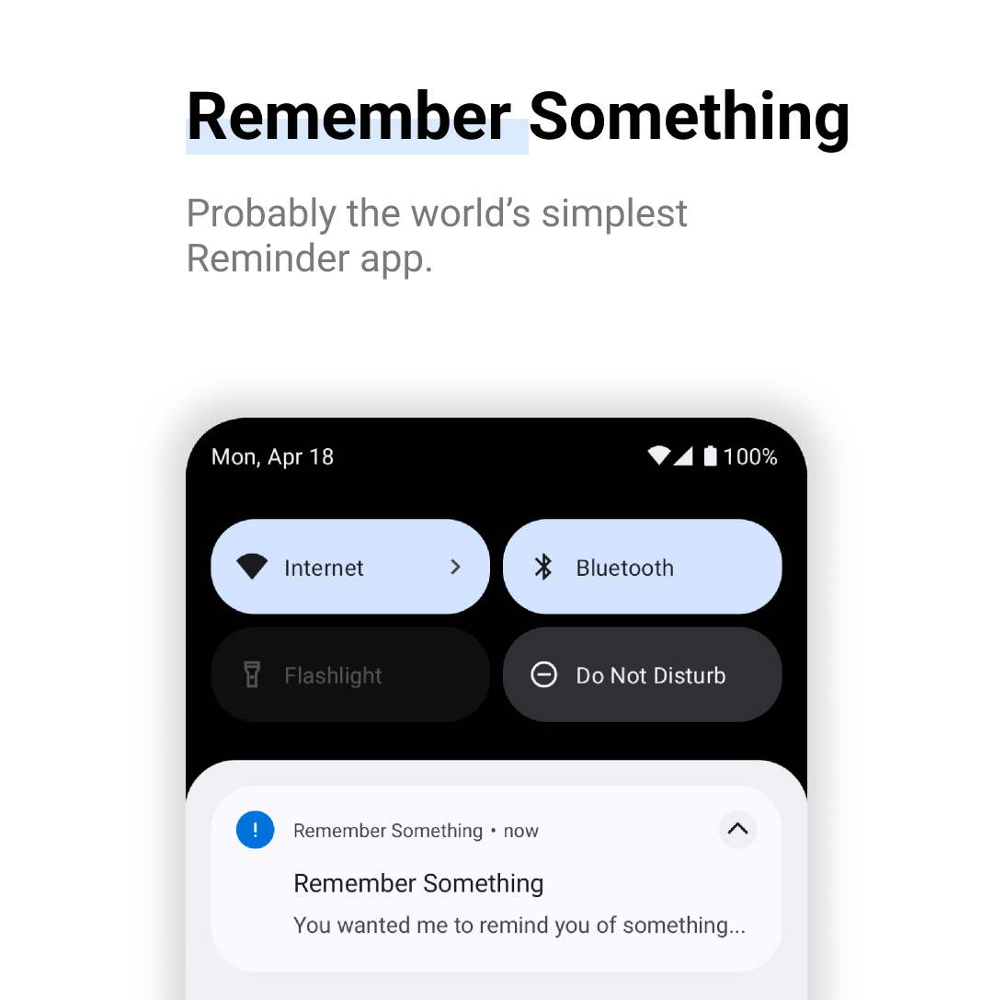
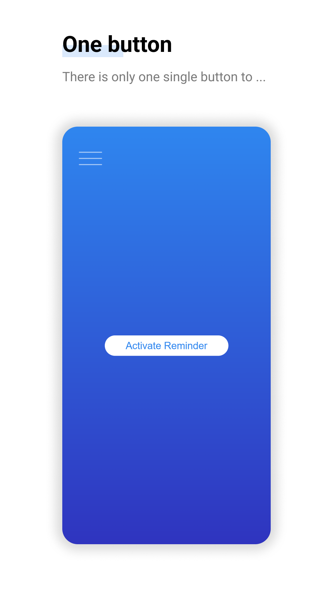
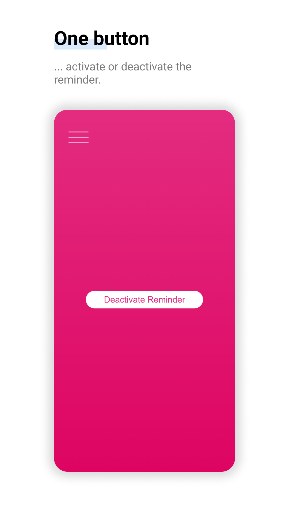

# Remember Something

Remember Something is a very simple Reminder app running on Android. Built with TypeScript, Angular, Ionic, and Capacitor.

  

The app is available on the Google Play Store. If you would like to build it yourself, then take a look at the [build documentation](docs/build.md).

## Features

As described earlier, Remember Something is a very simple Reminder app. There is only one button that allows you to enable (or disable) the reminder. When the reminder is enabled, the app will create a "sticky" notification that cannot be swiped away.

Thus, the app will only remind you that there is _something_ you have to do. It will not remind you of _what it was_. Have you ever put an object in an unusual place in order to remind you of something? This app is the digital version of that.

The reminder can be created very quickly: You don't have to type any information into your device. Very useful if you are in a hurry.

  
  

## Legal Information

Google Play and the Google Play logo are trademarks of Google LLC.
